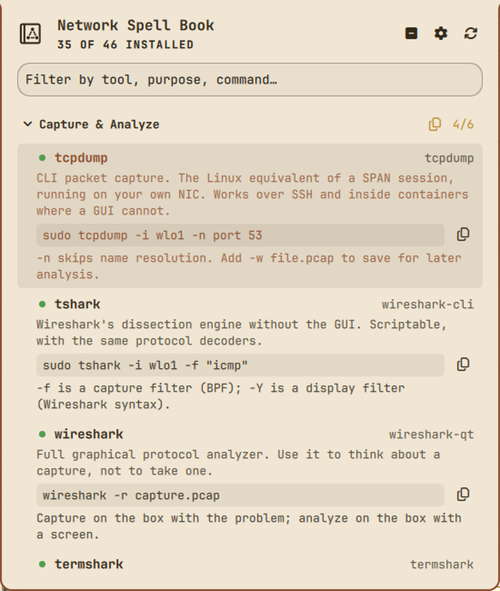
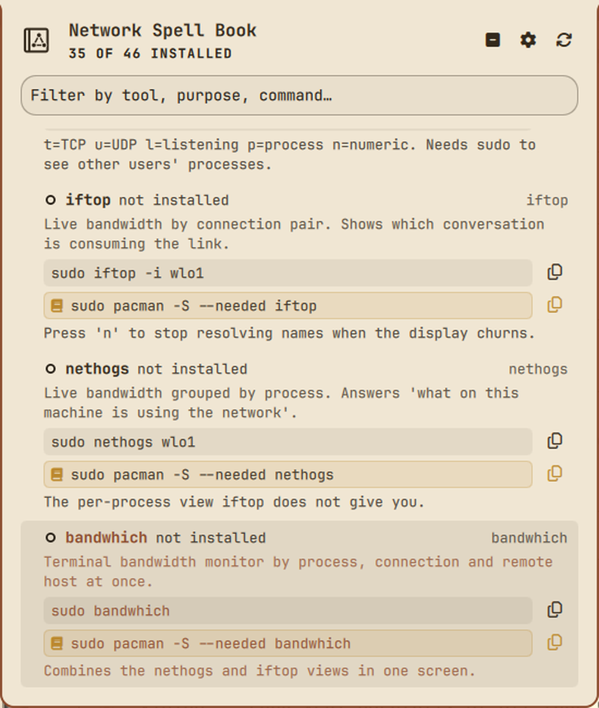
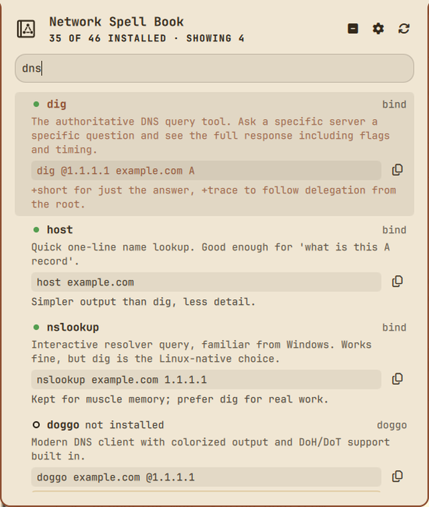
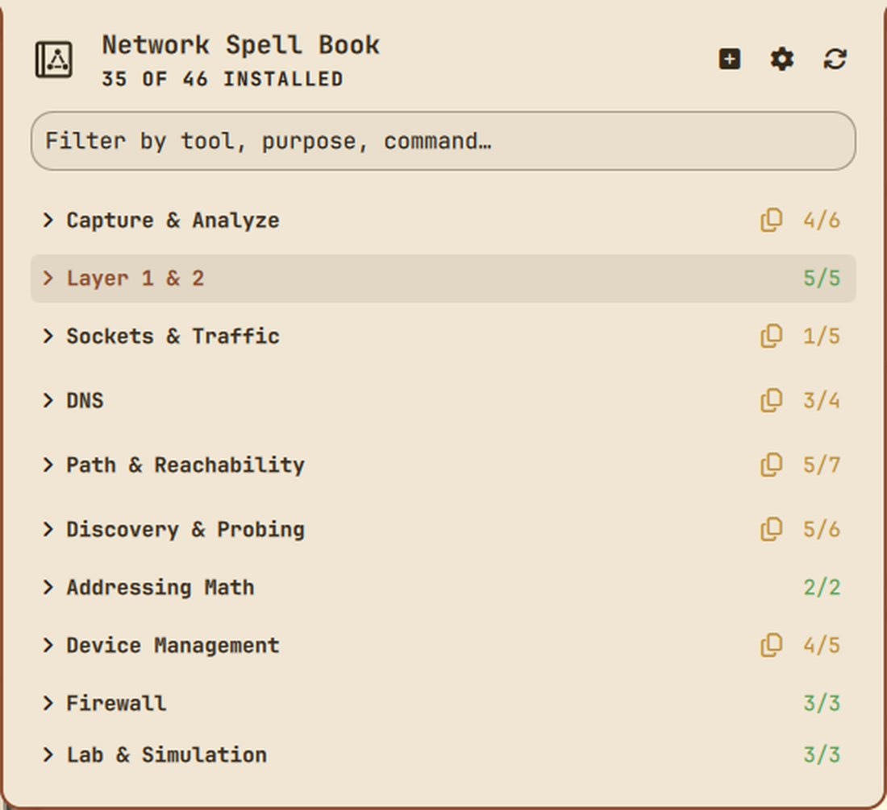

# Network Spell Book

A reference grimoire for network engineering tools, living in the Omarchy bar.



One icon, one popup: your network tooling grouped by purpose, what each tool
actually does, and a starter command you can copy with a keystroke. It shows
what is installed on *this* machine and what is not, so the catalog doubles as
a shopping list.

Built for the moment you know the concept but not the Linux incantation.

| Missing tools offer an install command | Type to filter | Collapsed overview |
| --- | --- | --- |
|  |  |  |

## What it does

- **Curated catalog** of network engineering tools across ten categories —
  capture and analysis, DNS, path and reachability, layer 1/2, sockets and
  traffic, discovery, addressing math, device management, firewall, and lab.
- **Installed detection** per tool, shown as a filled dot (present) or a hollow
  ring (absent). State is encoded in *shape as well as colour*, so it stays
  readable on any theme and for colour-blind users.
- **Per-section tally** (`4/6`) on every header, coloured green / amber / grey
  for all-present / partly-present / none — a collapsed section still tells you
  what is inside it.
- **Starter command** for each tool in a monospace box, with a copy button.
- **Add Spell to Book** — for any tool you don't have, an install command
  (`sudo pacman -S --needed <pkg>`, or `yay -S <pkg>` for AUR packages) shown
  in a highlighted box with its own copy button. Section headers offer a bulk
  version covering everything missing in that section.
- **Practical notes** — the caveat you would otherwise learn the hard way
  (middle-hop loss in `mtr` is ICMP rate-limiting; `lldpd` advertises you on
  the wire; `ethtool` is near-useless on WiFi).
- **Type-to-filter** across tool names, descriptions, commands and notes.

## What it deliberately does NOT do

This plugin is **read-only**. That is a design constraint, not an oversight:

- It **never executes a catalogued tool.** Installed-state detection resolves
  the binary name against `PATH` and checks the execute bit — a `stat`, not a
  fork. Adding an entry to the catalog cannot cause anything to run.
- It **never installs anything** and never invokes a package manager. "Add
  Spell to Book" *shows you* the install command and copies it on request. You
  paste it, read it, and run it yourself. Installing software means elevating
  privileges, and that decision belongs to a human who has seen the command —
  not to a one-click button in a bar widget.
- It **makes no network connections** of any kind. A tool catalog that quietly
  probed your network would be a surprising thing to have in a bar widget.
- It **writes nothing** outside `~/.config/omarchy/spellbook/`, which holds only
  which sections you collapsed. That directory is opened with `O_NOFOLLOW` and
  every read, write and permission change is performed relative to the open
  descriptor, so a symlink planted at the state path is refused by the kernel
  rather than followed onto an unrelated file.
- It **handles no credentials.**

The single action available is copying reference text to your clipboard. You
paste it into a terminal and read it before pressing Enter — which is the point.

Package names are validated against a strict charset before they are placed
into a displayed install command, so a hand-edited or third-party catalog
cannot smuggle `; rm -rf ~` into something you are about to paste into a shell.
A name that fails validation produces no install command at all.

## Usage

Click the book icon in the bar, or right-click it to force a re-scan.

| Key | Action |
| --- | --- |
| `/` | Focus the filter |
| `↑` `↓` | Move selection |
| `Enter` | Copy the selected tool's command (fold/unfold on a header) |
| `a` | **Add Spell to Book** — copy the install command for a missing tool, or for everything missing in the selected section. Use `Ctrl+A` while the filter has focus, where a bare `a` is just a letter. |
| `←` `→` | Fold / unfold a section |
| `Space` | Fold the selected section |
| `c` / `e` | Collapse all / expand all |
| `r` | Re-scan installed tools |
| `,` | Toggle the settings panel |
| `Esc` | Clear the filter, then close |

While a filter is active, every section is forced open — a search must never
hide a match behind a collapsed header — and folding is disabled so the filter
cannot silently rearrange state you can't see.

## Settings

Available in the bar widget settings panel:

- **Show tools that are not installed** — keep the catalog complete, or show
  only what this machine can run.
- **Re-scan interval (minutes)** — how often to re-check. Only ticks after the
  popup has been opened at least once, so an untouched widget costs nothing.
- **Open with all sections collapsed** — drill into one area at a time.

## Editing the catalog

The catalog is plain data in `catalog.json`. Add your own tools freely:

```json
{
  "bin": "mytool",
  "pkg": "mytool-package",
  "repo": "repo",
  "what": "What it does, in a sentence or two.",
  "cmd": "mytool --example",
  "note": "The caveat you'd otherwise learn the hard way."
}
```

`repo` selects the install command: `"repo"` (the default if omitted or
unrecognised) yields `sudo pacman -S --needed <pkg>`, and `"aur"` yields
`yay -S <pkg>`.

The file is treated as untrusted input even though it ships with the plugin:
reads are bounded by byte count, nesting depth, category count and tool count,
and both binary and package names are checked against a strict charset. A name
containing a slash, a space or a shell metacharacter is rejected rather than
sanitized — and a rejected package name is dropped from the output entirely, so
it can never be displayed as text you might retype by hand. Every ceiling is
raisable by environment variable (`SPELLBOOK_MAX_BYTES`,
`SPELLBOOK_MAX_CATEGORIES`, `SPELLBOOK_MAX_TOOLS`, `SPELLBOOK_MAX_DEPTH`) and
the variable is named in the error, so a genuinely large catalog is never a
dead end. A value below the usable floor falls back to the default rather than
clamping, so a typo cannot leave the plugin unable to read its own catalog.

## Tests

The security posture is asserted by a runnable suite rather than by prose:

```bash
python3 tests/test_scan.py     # catalog handling — 79 cases
python3 tests/test_state.py    # state file handling — 34 cases
```

`test_scan.py` covers command injection through `bin`/`pkg`/`repo` fields, byte
and record and depth caps, FIFO and `/proc` style streaming inputs, hostile
environment values, malformed JSON structure, output file permissions, peak
memory on oversized input, and static checks that no execution primitive and no
direct QML file write exists anywhere in the shipped sources.

`test_state.py` covers the UI state file: a symlinked state file, a symlinked
state directory, oversized and non-regular files, loose pre-existing directory
permissions, and malformed payloads. Each hostile case asserts both that the
attack was refused *and* that the decoy target was left byte-for-byte untouched.

## Requirements

A note for reviewers: `catalog.json` contains command strings that begin with
`sudo` (for example `sudo tcpdump -i wlo1 -n port 53`), and the plugin composes
package-install strings of the form `sudo pacman -S --needed <pkg>` / `yay -S
<pkg>`. All of these are **reference text shown in the UI and copied to the
clipboard on request**. The plugin has no code path that executes them, requests
elevation, or invokes a package manager — `bin/spellbook-copy` writes to the
clipboard and nothing else, and the only other subprocesses are the scan helper
and the state helper, which reads and writes the plugin's own collapsed-section
file. This can be verified mechanically:

```bash
grep -n "command:" *.qml                              # 4 fixed-argv helpers
grep -nE '\beval\b|subprocess|os\.system|shell=True' bin/*   # no matches
grep -nE 'FileView|setText\(' *.qml                   # no direct file writes
```

- Omarchy 4.x (Quickshell-based bar)
- Python 3 (ships with Arch)
- `wl-copy` from `wl-clipboard` for the copy button — present on a standard
  Omarchy install. `xclip` is used as a fallback if found.

No tool in the catalog is required. Missing ones are simply shown as missing.

## Install

```bash
git clone <repo-url> ~/.config/omarchy/plugins/wizard.spellbook
omarchy plugin validate ~/.config/omarchy/plugins/wizard.spellbook
omarchy plugin enable wizard.spellbook right
omarchy restart shell
```

## Uninstall

```bash
omarchy plugin disable wizard.spellbook
rm -rf ~/.config/omarchy/plugins/wizard.spellbook
rm -rf ~/.config/omarchy/spellbook     # collapsed-section state
omarchy restart shell
```

## License

MIT. See `LICENSE`.
